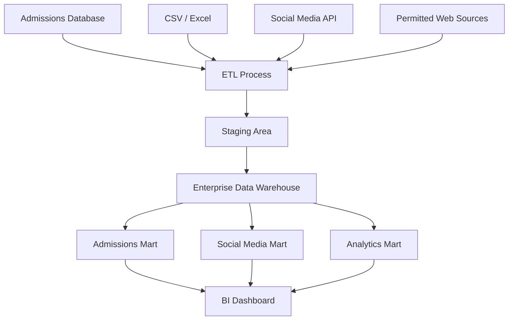
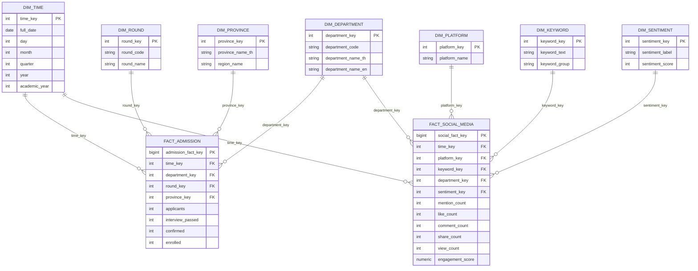

# Social Media Impact Analytics for Engineering Admissions
## Data Warehouse Project

**Faculty of Engineering, Kasetsart University Kamphaeng Saen Campus**

---

## 1. Project Overview

### Background

การรับสมัครนักศึกษาในปัจจุบันไม่ได้ขึ้นอยู่กับชื่อเสียงของมหาวิทยาลัยเพียงอย่างเดียว แต่ได้รับอิทธิพลจาก Social Media อย่างมาก เช่น Facebook, X (Twitter), TikTok, YouTube, Pantip และเว็บไซต์ข่าวต่าง ๆ

นักเรียนจำนวนมากค้นหาข้อมูล รีวิว ประสบการณ์ และความคิดเห็นของรุ่นพี่ก่อนตัดสินใจสมัครเรียน ทำให้ Social Media กลายเป็นปัจจัยสำคัญที่อาจส่งผลต่อจำนวนผู้สมัครในแต่ละปี

ปัจจุบันข้อมูลที่เกี่ยวข้องกระจัดกระจายอยู่หลายแหล่ง เช่น ระบบรับสมัครของมหาวิทยาลัย, Facebook, X, Pantip, TikTok, YouTube, Website และ News จึงต้องออกแบบ Data Warehouse เพื่อรวบรวมข้อมูลทั้งหมดไว้ในที่เดียว และนำมาวิเคราะห์ความสัมพันธ์ระหว่างกระแสบน Social Media กับจำนวนผู้สมัครจริง

---

## 2. Problem Statement

คณะวิศวกรรมศาสตร์ยังไม่มีระบบกลางที่สามารถวิเคราะห์ข้อมูลการรับสมัครร่วมกับข้อมูล Social Media ได้อย่างเป็นระบบ ทำให้ยังตอบคำถามสำคัญได้ยาก เช่น

- Social Media Platform ไหนมีการพูดถึงมากที่สุด
- Keyword ใดได้รับความนิยม
- ช่วงเวลาใดมีการกล่าวถึงมากที่สุด
- เมื่อ Social Media มีการพูดถึงเพิ่มขึ้น จำนวนผู้สมัครเพิ่มขึ้นจริงหรือไม่
- ผู้สมัครผ่านแต่ละขั้นตอนกี่คน
- จุดที่ผู้สมัครหลุดออกจาก Funnel มากที่สุดคือช่วงใด
- สาขาใดได้รับความสนใจมากที่สุด

---

## 3. Objectives

1. ออกแบบ Data Warehouse สำหรับข้อมูลการรับสมัคร
2. รวมข้อมูลจากหลายแหล่ง ทั้ง Internal Data และ External Data
3. วิเคราะห์ข้อมูลการกล่าวถึงบน Social Media
4. วิเคราะห์แนวโน้มการรับสมัครย้อนหลังหลายปี
5. วิเคราะห์ความสัมพันธ์ระหว่าง Social Media กับจำนวนผู้สมัคร
6. สร้าง Dashboard สำหรับผู้บริหารเพื่อสนับสนุนการตัดสินใจ

---

## 4. Scope

### Internal Data

ข้อมูลการรับสมัครของคณะวิศวกรรมศาสตร์ทุกสาขา ประกอบด้วย:

- ปีการศึกษา
- รอบ TCAS
- สาขา
- จังหวัด
- จำนวนผู้สมัคร
- จำนวนผ่านสัมภาษณ์
- จำนวนยืนยันสิทธิ์
- จำนวนรับเข้าศึกษาจริง

### External Data

ข้อมูลจาก Social Media และแหล่งข้อมูลออนไลน์ ประกอบด้วย:

- Facebook
- X (Twitter)
- Pantip
- TikTok
- YouTube
- Website
- News

---

## 5. Business Questions

### Admissions

- มีผู้สมัครทั้งหมดกี่คน
- มีผู้ผ่านสัมภาษณ์กี่คน
- มีผู้ยืนยันสิทธิ์กี่คน
- มีผู้เข้าศึกษาจริงกี่คน
- Round ไหนมีผู้สมัครมากที่สุด
- สาขาใดได้รับความนิยมมากที่สุด
- จังหวัดใดมีผู้สมัครมากที่สุด

### Social Media

- Platform ไหนถูกพูดถึงมากที่สุด
- Keyword ไหนถูกพูดถึงมากที่สุด
- ช่วงเวลาใดมีการกล่าวถึงสูงสุด
- จำนวน Mention เพิ่มขึ้นช่วงใด
- Sentiment โดยรวมเป็นอย่างไร

### Analytics

- Mention เพิ่มขึ้น ส่งผลต่อจำนวนผู้สมัครหรือไม่
- Sentiment ส่งผลต่อจำนวนผู้สมัครหรือไม่
- Platform ไหนสร้าง Engagement สูงสุด
- สาขาใดได้รับการพูดถึงมากที่สุด
- จังหวัดใดมีผู้สมัครมากที่สุด

---

## 6. Data Sources

### Source 1: Admissions Database

| Field | Description |
|---|---|
| Academic Year | ปีการศึกษา |
| TCAS Round | รอบการรับสมัคร |
| Department | สาขาวิชา |
| Province | จังหวัดของผู้สมัคร |
| Applicants | จำนวนผู้สมัคร |
| Interview Passed | จำนวนผู้ผ่านสัมภาษณ์ |
| Confirmed | จำนวนผู้ยืนยันสิทธิ์ |
| Enrolled | จำนวนผู้เข้าศึกษาจริง |

### Source 2: Social Media

| Field | Description |
|---|---|
| Date | วันที่โพสต์หรือวันที่พบข้อมูล |
| Platform | แพลตฟอร์ม |
| Keyword | คำค้นหรือหัวข้อที่เกี่ยวข้อง |
| Post | ข้อความโพสต์ |
| Like | จำนวน Like |
| Comment | จำนวน Comment |
| Share | จำนวน Share |
| View | จำนวน View |
| Sentiment | Positive, Neutral, Negative |

---

## 7. Keywords for Data Collection

ตัวอย่าง Keyword สำหรับเก็บข้อมูล:

- วิศวะเกษตรกำแพงแสน
- วิศวกรรมศาสตร์ กำแพงแสน
- KU KPS Engineering
- TCAS วิศวะเกษตร
- วิศวะ KU
- Computer Engineering KPS
- Mechanical Engineering KPS
- Electrical Engineering KPS
- Civil Engineering KPS
- เข้าวิศวะเกษตร
- รีวิววิศวะเกษตร
- สอบเข้าวิศวะเกษตร

---

## 8. ETL Process

### Extract

ดึงข้อมูลจาก:

- Admissions Database
- CSV
- Excel
- Social Media API
- Web Scraping เฉพาะข้อมูลที่ได้รับอนุญาตและไม่ละเมิดเงื่อนไขการใช้งานของแพลตฟอร์ม

### Transform

ขั้นตอนทำความสะอาดและแปลงข้อมูล:

- Remove Duplicate
- Remove Null หรือเติมค่า Missing Value ตามกฎที่กำหนด
- Normalize Department ให้ชื่อสาขาเป็นมาตรฐานเดียวกัน
- Standardize Date ให้อยู่ในรูปแบบเดียวกัน
- Convert Sentiment ให้เป็น Positive, Neutral, Negative
- Clean Text เช่น ลบ URL, Emoji, Special Character ที่ไม่จำเป็น
- Keyword Extraction เพื่อระบุคำสำคัญที่เกี่ยวข้องกับสาขาและการรับสมัคร
- Calculate Engagement จาก Like, Comment, Share และ View

### Load

โหลดข้อมูลเข้าสู่ Enterprise Data Warehouse บน PostgreSQL และจัดเก็บในรูปแบบ Star Schema เพื่อรองรับการทำ BI Dashboard และการวิเคราะห์เชิงสถิติ

---

## 9. Data Warehouse Architecture



---

## 10. Star Schema Design

### FactAdmission

**Grain:** 1 record per academic year, TCAS round, department, province, and date period.

Measures:

- Applicants
- InterviewPassed
- Confirmed
- Enrolled

Dimensions:

- DimTime
- DimDepartment
- DimRound
- DimProvince

### FactSocialMedia

**Grain:** 1 record per social media post or aggregated mention by date, platform, keyword, department, and sentiment.

Measures:

- Mention
- Like
- Comment
- Share
- View
- Engagement

Dimensions:

- DimTime
- DimPlatform
- DimKeyword
- DimDepartment
- DimSentiment

### Logical Schema



---

## 11. Dashboard Design

### Dashboard 1: Admissions Overview

แสดงภาพรวมการรับสมัคร:

- Applicants
- Interview Passed
- Confirmed
- Enrolled
- Interview Rate
- Confirmation Rate
- Enrollment Rate

### Dashboard 2: Admissions Trend

วิเคราะห์จำนวนผู้สมัครย้อนหลังหลายปี:

- Applicants by Academic Year
- Applicants by TCAS Round
- Applicants by Department
- Applicants by Province

### Dashboard 3: Social Media Trend

วิเคราะห์แนวโน้มจำนวน Mention:

- Daily Mention
- Monthly Mention
- Yearly Mention
- Mention Growth

### Dashboard 4: Platform Analytics

เปรียบเทียบผลลัพธ์จากแต่ละ Platform:

- Facebook
- X
- Pantip
- TikTok
- YouTube
- Website
- News

### Dashboard 5: Sentiment Analysis

วิเคราะห์ Sentiment:

- Positive
- Neutral
- Negative
- Sentiment by Platform
- Sentiment by Department

### Dashboard 6: Keyword Analytics

วิเคราะห์คำค้นยอดนิยม:

- Top Keyword
- Top Hashtag
- Keyword by Department
- Keyword Trend

### Dashboard 7: Admissions Funnel

แสดง Funnel การรับสมัคร:

```text
Applicants
    ↓
Interview Passed
    ↓
Confirmed
    ↓
Enrolled
```

### Dashboard 8: Correlation Dashboard

วิเคราะห์ความสัมพันธ์ระหว่าง Social Media กับ Admissions:

- Mention vs Applicants
- Engagement vs Applicants
- Sentiment Score vs Applicants
- Scatter Plot
- Regression Line
- Correlation Coefficient

---

## 12. KPIs

### Admissions KPIs

| KPI | Formula |
|---|---|
| Applicants | Sum(Applicants) |
| Interview Rate | Interview Passed / Applicants |
| Confirmation Rate | Confirmed / Interview Passed |
| Enrollment Rate | Enrolled / Confirmed |
| Applicant Growth | (Current Applicants - Previous Applicants) / Previous Applicants |

### Social Media KPIs

| KPI | Formula |
|---|---|
| Total Mention | Sum(Mention Count) |
| Engagement | Like + Comment + Share + View |
| Engagement Rate | Engagement / Mention Count |
| Mention Growth | (Current Mentions - Previous Mentions) / Previous Mentions |
| Positive Sentiment Rate | Positive Mentions / Total Mentions |

### Analytics KPIs

| KPI | Formula |
|---|---|
| Correlation Score | Correlation(Mention, Applicants) |
| Sentiment Impact | Correlation(Sentiment Score, Applicants) |
| Platform Impact | Applicants grouped by dominant platform engagement |

---

## 13. Technologies

### Database

- PostgreSQL

### ETL

- Python
- Pandas
- SQL

### Social Media Collection

- Facebook Graph API หากได้รับสิทธิ์
- X API หากได้รับสิทธิ์
- YouTube Data API
- Web Scraping เฉพาะข้อมูลที่อนุญาต

### Data Warehouse

- PostgreSQL
- Star Schema
- Staging Tables
- Scheduled ETL

### Dashboard

- Power BI
- Tableau
- Metabase

---

## 14. Example Analytical Queries

### Applicants by Department

```sql
SELECT
    d.department_name_en,
    SUM(f.applicants) AS total_applicants,
    SUM(f.enrolled) AS total_enrolled
FROM fact_admission f
JOIN dim_department d ON f.department_key = d.department_key
GROUP BY d.department_name_en
ORDER BY total_applicants DESC;
```

### Social Media Mentions by Platform

```sql
SELECT
    p.platform_name,
    SUM(f.mention_count) AS total_mentions,
    SUM(f.engagement_score) AS total_engagement
FROM fact_social_media f
JOIN dim_platform p ON f.platform_key = p.platform_key
GROUP BY p.platform_name
ORDER BY total_mentions DESC;
```

### Mention and Applicant Trend by Month

```sql
WITH monthly_admissions AS (
    SELECT
        t.calendar_year,
        t.month_number,
        SUM(a.applicants) AS applicants
    FROM fact_admission a
    JOIN dim_time t ON a.time_key = t.time_key
    GROUP BY t.calendar_year, t.month_number
),
monthly_social AS (
    SELECT
        t.calendar_year,
        t.month_number,
        SUM(s.mention_count) AS mentions
    FROM fact_social_media s
    JOIN dim_time t ON s.time_key = t.time_key
    GROUP BY t.calendar_year, t.month_number
)
SELECT
    COALESCE(a.calendar_year, s.calendar_year) AS calendar_year,
    COALESCE(a.month_number, s.month_number) AS month_number,
    COALESCE(a.applicants, 0) AS applicants,
    COALESCE(s.mentions, 0) AS mentions
FROM monthly_admissions a
FULL OUTER JOIN monthly_social s
    ON a.calendar_year = s.calendar_year
   AND a.month_number = s.month_number
ORDER BY calendar_year, month_number;
```

### Correlation Between Mentions and Applicants

```sql
WITH monthly_admissions AS (
    SELECT
        t.calendar_year,
        t.month_number,
        SUM(a.applicants) AS applicants
    FROM fact_admission a
    JOIN dim_time t ON a.time_key = t.time_key
    GROUP BY t.calendar_year, t.month_number
),
monthly_social AS (
    SELECT
        t.calendar_year,
        t.month_number,
        SUM(s.mention_count) AS mentions
    FROM fact_social_media s
    JOIN dim_time t ON s.time_key = t.time_key
    GROUP BY t.calendar_year, t.month_number
),
monthly_data AS (
    SELECT
        a.calendar_year,
        a.month_number,
        a.applicants,
        s.mentions
    FROM monthly_admissions a
    JOIN monthly_social s
        ON a.calendar_year = s.calendar_year
       AND a.month_number = s.month_number
)
SELECT
    corr(mentions, applicants) AS mention_applicant_correlation
FROM monthly_data
WHERE mentions IS NOT NULL
  AND applicants IS NOT NULL;
```

---

## 15. Expected Benefits

มหาวิทยาลัยสามารถ:

- วิเคราะห์แนวโน้มการรับสมัคร
- วิเคราะห์กระแสบน Social Media
- ประเมินประสิทธิภาพของการประชาสัมพันธ์
- วางแผนการรับนักศึกษาในอนาคต
- ใช้ข้อมูลประกอบการตัดสินใจเชิงบริหาร
- ระบุสาขาและพื้นที่จังหวัดที่ควรสื่อสารเชิงรุก
- วัดผลกระทบของแคมเปญออนไลน์ต่อจำนวนผู้สมัคร

---

## 16. Future Improvements

- AI วิเคราะห์ Sentiment ภาษาไทย
- Topic Modeling
- Trend Prediction
- Applicant Forecasting
- Recommendation System สำหรับแนะนำช่องทางประชาสัมพันธ์
- Real-time Dashboard
- Automatic ETL Pipeline
- Data Quality Monitoring
- Campaign Attribution Analysis

---

## 17. Conclusion

โครงการ Social Media Impact Analytics for Engineering Admissions เป็นการออกแบบ Data Warehouse เพื่อรวมข้อมูลการรับสมัครและข้อมูล Social Media ไว้ในศูนย์กลางเดียว ช่วยให้คณะวิศวกรรมศาสตร์สามารถวิเคราะห์แนวโน้มการสมัคร ความนิยมของสาขา ประสิทธิภาพของช่องทาง Social Media และความสัมพันธ์ระหว่างกระแสออนไลน์กับจำนวนผู้สมัครจริงได้อย่างเป็นระบบ

ระบบนี้จะช่วยให้ผู้บริหารวางแผนการประชาสัมพันธ์และการรับสมัครได้แม่นยำขึ้น โดยใช้ข้อมูลเป็นพื้นฐานในการตัดสินใจ
